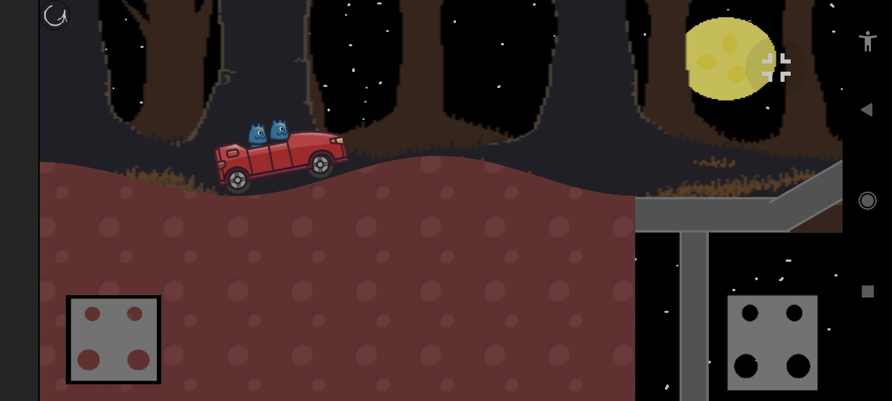
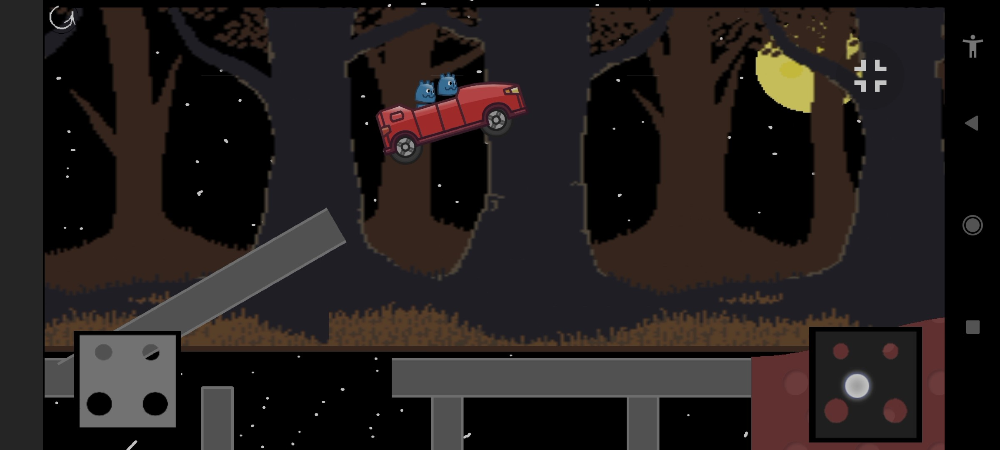

I attempted to make a **Hill Climb Racing** copy in Godot4.
I mostly followed [this](https://youtu.be/nPX9MrnvNLo?si=u4AiFhPhGbwcUdtd) tutorial.
For the terrain generation, I followed another tutorial but can't quite remember which one.

Here are some screenshots:

